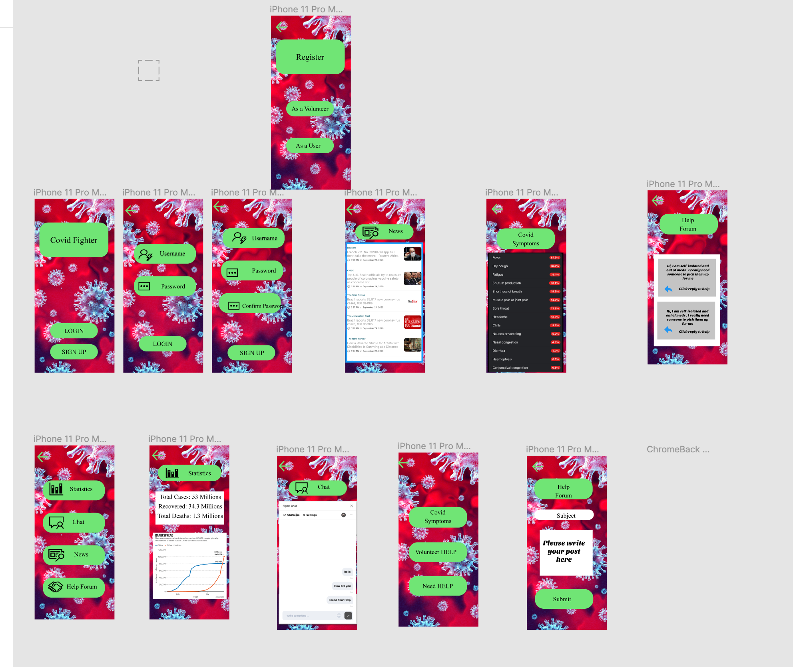

# FinalCovidFighter
# COVID-Fighter
This application is specifically designed for helping people in the difficult times of Coronavirus. This app is very informative as it not only gives the updated statistics of the world as well as it also gives you all the news related to it with just a single tap. This app also offers a help-forum which enables help-seekers to find help easily as well as the volunteers a platform that they can use to find people who are in need of help. This help also has a chat messaging system where people can ask questions to others as well as answer them.

[Prototype LINK:](https://www.figma.com/proto/vymLddha4wRE4dEwV8Dmlt/Covid-Fighter?node-id=1%3A104&viewport=459%2C411%2C0.23525682091712952&scaling=min-zoom&hide-ui=1)   

Features:
1)	Registering as a Volunteer/User
2)	Finding help if someone needs help such as senior citizen
3)	Posting an ad seeking help from others 
4)	Chatting with person seeking help
5)	Showing statistics updates of coronavirus around the world/Canada
6)	News Forum containing News that contains the word “Coronavirus” in it from different news Websites to show pandemic related news.
7)	Covid Symptoms button to help people with information such as symptoms, preventions etc. 

#Prototype Images 

User Testing LINKS: 
[User 1](https://youtu.be/BwsM6T6qRSE) 
[User -2](https://youtu.be/cs767xOfPzo) 
[User -3](https://youtu.be/tcuqLYUOt04) 	
